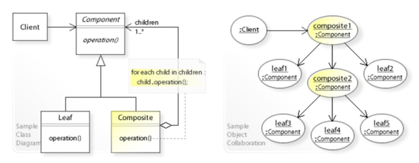
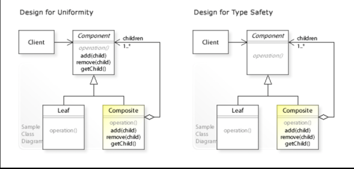
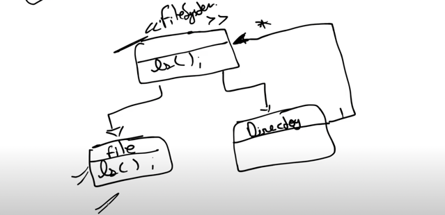

## Composite Design Pattern 
Object inside Object 

1. Design File System
2. Design Calculator
The composite pattern describes a group of objects that are treated the same way as a single instance of the same type of object. The intent of a composite is to "compose" objects into tree structures to represent part-whole hierarchies

